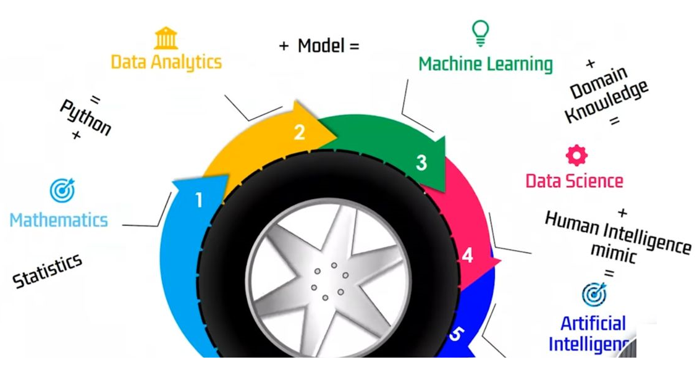
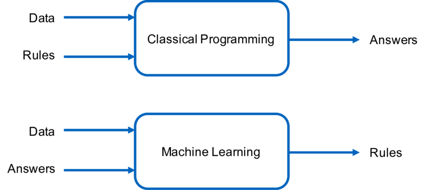
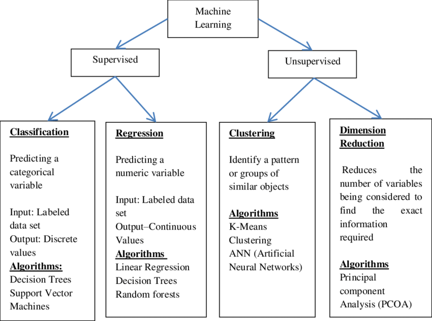
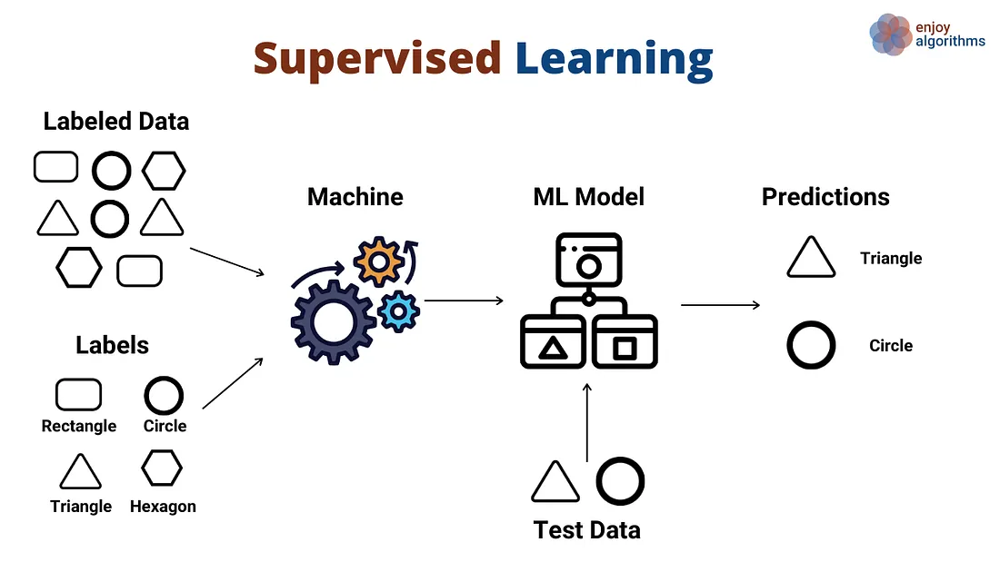
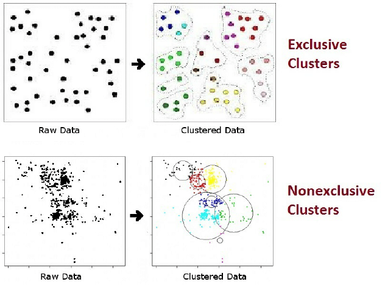
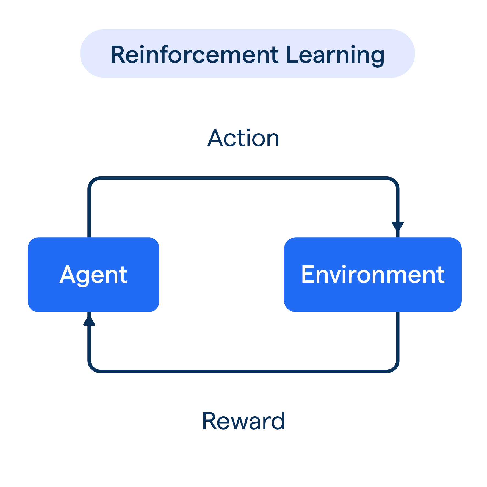
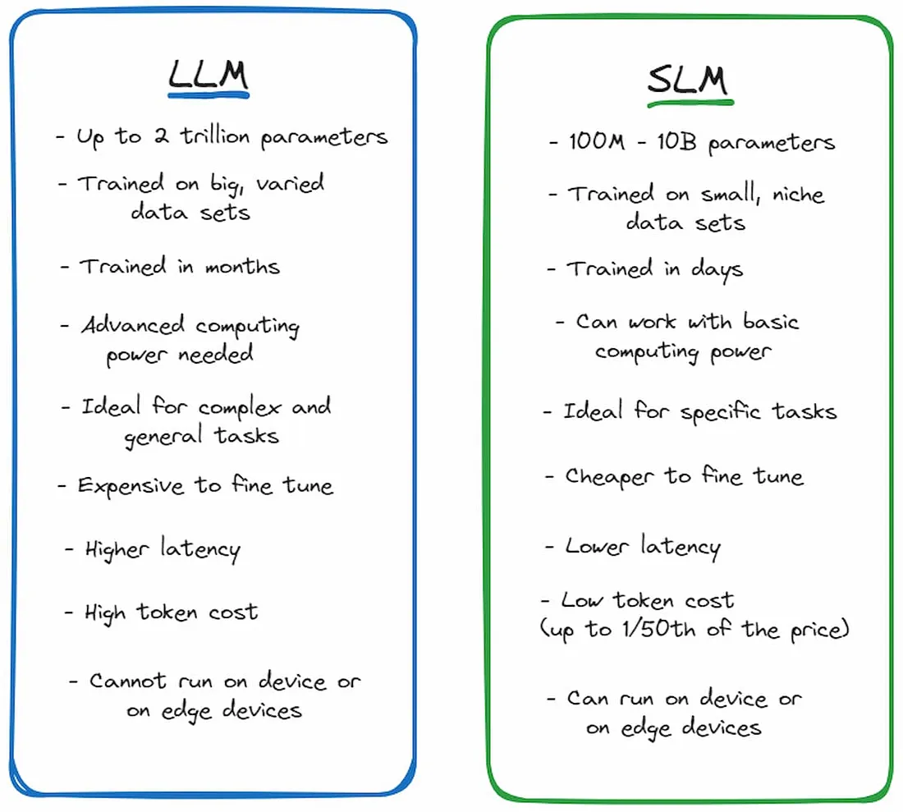
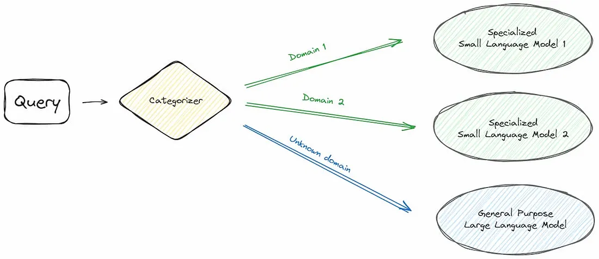
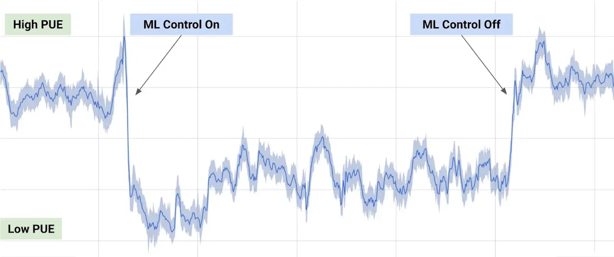

### AI ML Learning path

### Difference between Traditional Programming and Machine Learning?

### Broad Classification of Machine Learning Techniques

### what is machine learning?
A machine learning algorithm is a set of instructions that enables a computer to learn from data, make predictions, and improve its performance over time. It's a key component of artificial intelligence (AI) that allows systems to automatically:

    1. Learn from data
    2. Identify patterns
    3. Make decisions
    4. Predict outcomes

### Supervised Learning:
Trained on labeled data to predict outcomes (e.g., spam detection, image classification)

### Unsupervised Learning: 
Trained on unlabeled data to discover patterns (e.g., clustering, dimensionality reduction)

`In non-exclusive (or overlapping) clustering, objects may be assigned to multiple clusters. For instance, a grouping of people by age and sex is exclusive whereas a grouping by disease category is nonexclusive since a person can have several diseases at the same time`

### Reinforcement Learning: 
Trained through trial and error to make decisions (e.g., game playing, robotics)

## LLM

    L - Large
    L - Language
    M - Model

#### Popular LLMs:

    1. GPT-3 (OpenAI)
    2. BERT (Google)
    3. RoBERTa (Facebook AI)
    4. T5 (Google)
    5. LLaMA (Meta AI)

#### Broad categories 

    1. General-purpose LLMs:
        - BERT (Bidirectional Encoder Representations from Transformers)
        - RoBERTa (Robustly Optimized BERT Pretraining Approach)
        - XLNet (Extreme Language Modeling)
        - ELECTRA (Efficiently Learning an Encoder that Classifies Token Replacements Accurately)
    2. Specialized LLMs:
        - RouteLLM (Routing and network-related tasks)
        - CodeLLM (Programming languages and code generation)
        - BioLLM (Biological and medical text analysis)
        - FinLLM (Financial text analysis and forecasting)
    3. Multimodal LLMs:
        - CLIP (Contrastive Language-Image Pre-training)
        - DALL-E (Generative model for images and text)
        - VisualBERT (Vision-and-language pre-training)
    4. Conversational LLMs:
        - ChatGPT (Conversational AI for chatbots and dialogue systems)
        - DialoGPT (Dialogue generation and response prediction)
    5. Explainable LLMs:
        - LXMERT (Cross-modal explanation and reasoning)
        - ELECTRA-X (Explainable ELECTRA)
    6. Efficient LLMs:
        - DistilBERT (Distilled BERT for smaller models)
        - TinyBERT (Tiny and efficient BERT models)
    7. Domain-specific LLMs:
        - LegalLLM (Legal text analysis and prediction)
        - MedicalLLM (Medical text analysis and diagnosis)

#### Key Differences Between LLMs and SLMs

#### Choosing Between LLMs and SLMs

#### realtime use cases
 
https://deepmind.google/discover/blog/deepmind-ai-reduces-google-data-centre-cooling-bill-by-40/

#### try it out
https://chatgpt.com/ 
https://copilot.microsoft.com/ 
https://app.humata.ai/# 
Humata is an AI tool for text-based files that helps students to understand complex research paper or articles 
https://gemini.google.com/app/ 
https://app.simplified.com/ 
Acrobat AI Assistant 

#### read reference
https://github.com/lm-sys/RouteLLM
https://medium.com/vectrix-ai/llms-vs-slms-key-differences-in-large-and-small-language-models-142d9cbfbc56

