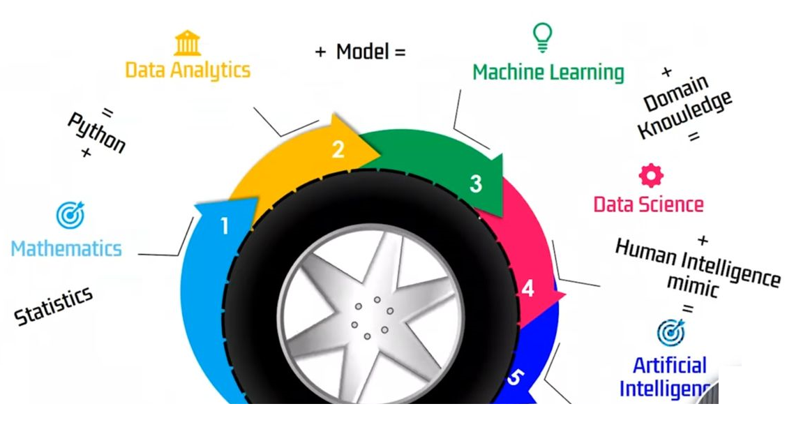
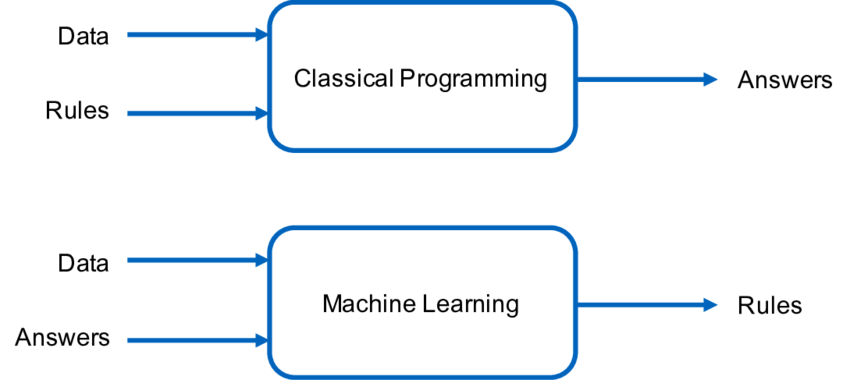
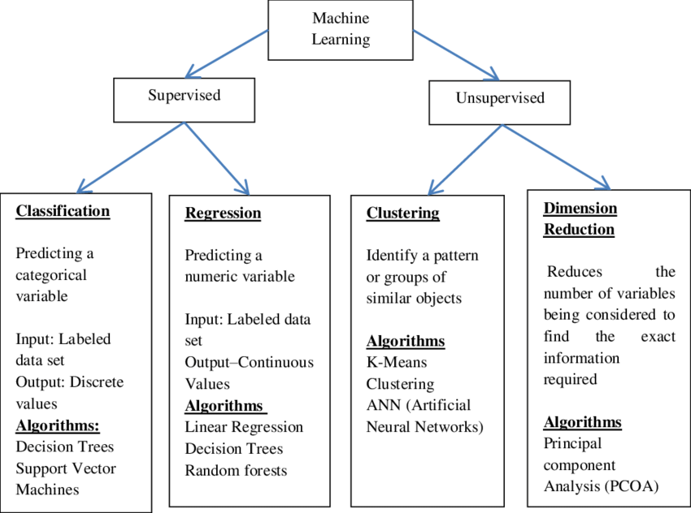
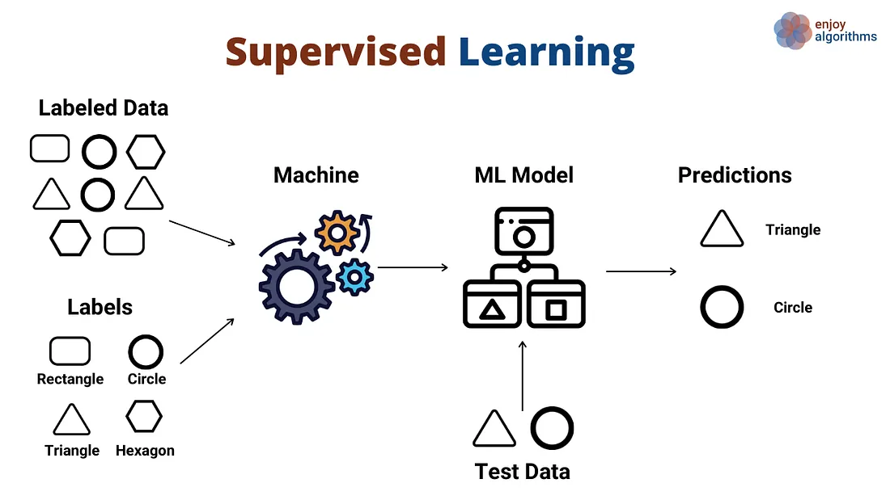
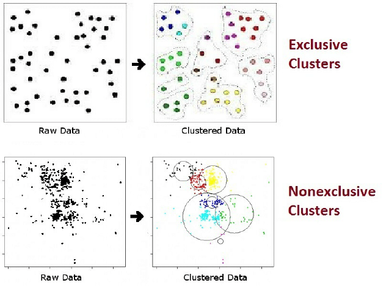
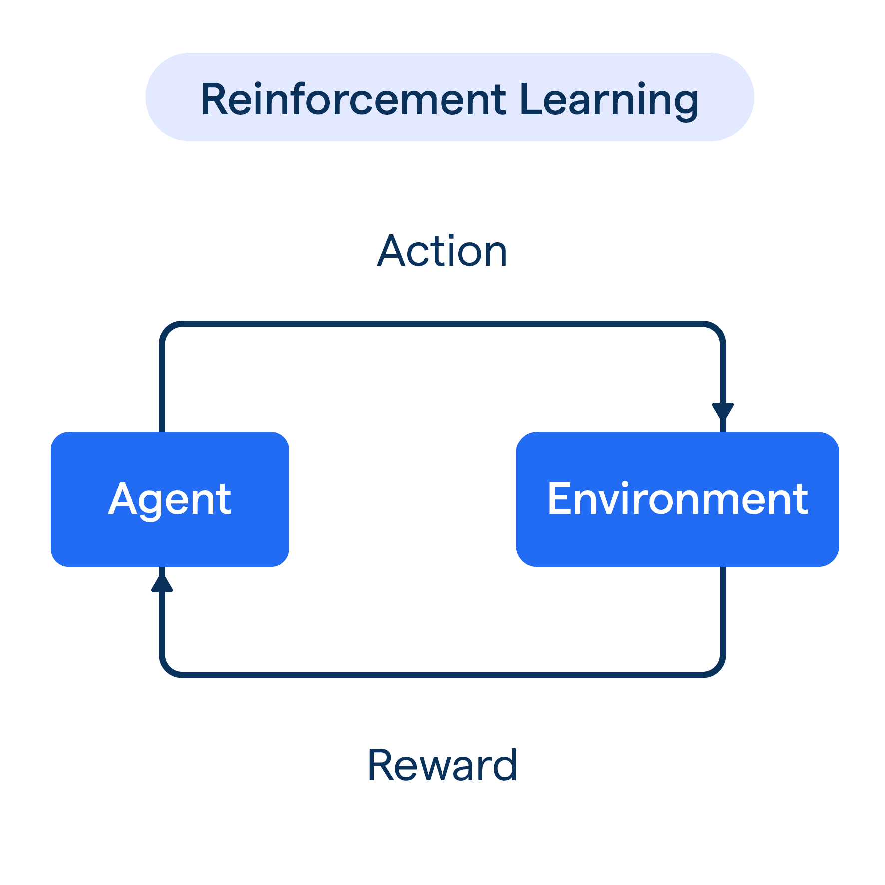

### AI ML Learning path

### Difference between Traditional Programming and Machine Learning?

### Broad Classification of Machine Learning Techniques

### what is machine learning?
A machine learning algorithm is a set of instructions that enables a computer to learn from data, make predictions, and improve its performance over time. It's a key component of artificial intelligence (AI) that allows systems to automatically:

    1. Learn from data
    2. Identify patterns
    3. Make decisions
    4. Predict outcomes

### Supervised Learning:
Trained on labeled data to predict outcomes (e.g., spam detection, image classification)

### Unsupervised Learning: 
Trained on unlabeled data to discover patterns (e.g., clustering, dimensionality reduction)

`In non-exclusive (or overlapping) clustering, objects may be assigned to multiple clusters. For instance, a grouping of people by age and sex is exclusive whereas a grouping by disease category is nonexclusive since a person can have several diseases at the same time`

### Reinforcement Learning: 
Trained through trial and error to make decisions (e.g., game playing, robotics)

#### Why use Reinforcement Learning?
    1. Ability to learn from interactions in complex and uncertain environments without explicitly needing programming for each possible scenario
    2. Adaptable decision-making based on dynamic conditions
    3. Continuous learning and improving from sparse, delayed feedback

### Who uses Reinforcement Learning?

    Robotics
    Gaming
    Finance
    Healthcare
    Supply Chain and Logistics
    Energy Management
    Telecommunications and Networking

### When to apply Reinforcement Learning?

    1. The problem environment is complex and uncertain, and traditional programming methods prove ineffective
    2. Decision-making (actions) follow a feedback loop
    3. Feedback is sparse, delayed, and dependent on multiple decisions
#### Where is Reinforcement Learning utilized?
    Autonomous vehicles and drones for navigation and control
    Simulation environments for training, analytics, and predicting system behavior
    Humanoid robotics or robotic manipulators in manufacturing processes
    Algorithmic trading and finance decision-making
    Personalized recommendation systems in e-commerce and media platforms
    Adaptive resource allocation and network routing in telecommunications
    Treatment plan personalization in healthcare management

#### Some common machine learning algorithms include:

    1. Linear Regression: Predicts continuous outcomes
    2. Decision Trees: Classifies data using tree-like models
    3. Random Forest: Ensemble learning using multiple decision trees
    4. Support Vector Machines (SVM): Finds hyperplanes to classify data
    5. Neural Networks: Inspired by human brain structure, used for deep learning
    6. K-Means Clustering: Groups similar data points into clusters
    7. Gradient Boosting: Ensemble learning using multiple weak models
